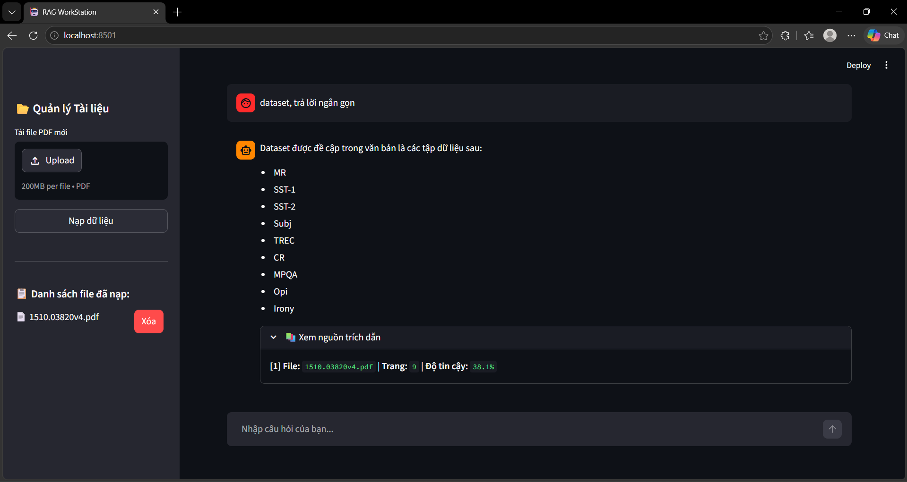

# Hệ thống RAG - Tầm soát & Hỏi đáp tự động từ Tài liệu

## 1. Giới thiệu
Dự án xây dựng một hệ thống RAG (Retrieval-Augmented Generation) nhằm mục đích truy xuất ngữ cảnh chính xác từ tập dữ liệu nội bộ và trả lời câu hỏi của người dùng. Hệ thống giúp giảm thiểu tối đa tình trạng "ảo giác" (hallucination) của LLM bằng cách ép mô hình chỉ trả lời dựa trên tài liệu được cung cấp.

## 2. Kiến trúc & Công nghệ
* **Ngôn ngữ:** Python
* * **LLM (Text Generation):** Llama 3 (Inference thông qua Groq API để tối ưu tốc độ phản hồi).
* **Embedding Model:** `sentence-transformers/all-MiniLM-L6-v2` 
* **Vector Database:** ChromaDB
* **Framework:** FastAPI, Streamlit

## 3. Luồng hoạt động (Pipeline)
1. **Data Ingestion:** Đọc và chia nhỏ tài liệu (Document Chunking).
2. **Embedding:** Chuyển đổi các chunk text thành vector thông qua `all-MiniLM-L6-v2`.
3. **Storage:** Lưu trữ vector vào Database.
4. **Retrieval:** Nhận câu hỏi từ người dùng, nhúng câu hỏi thành vector và tìm kiếm Top-K tài liệu có độ tương đồng ngữ nghĩa cao nhất.
5. **Generation:** Đưa ngữ cảnh (Context) thu được cùng câu hỏi vào Groq API để tổng hợp câu trả lời cuối cùng.

## 4. Hướng dẫn cài đặt

```bash
# 1. Clone repository
git clone <link_github_của_bạn>

# 2. Cài đặt các thư viện cần thiết
pip install -r requirements.txt

# 3. Cấu hình biến môi trường
# Tạo file .env ở thư mục gốc và thêm API key của Groq:
# GROQ_API_KEY="your_api_key_here"

# 4. Chạy ứng dụng
# Mở 1 terminal chạy 'uvicorn main:app --reload' và 1 terminal chạy 'streamlit run frontend.py'.
```

## 5. Demo 


*Thanks
